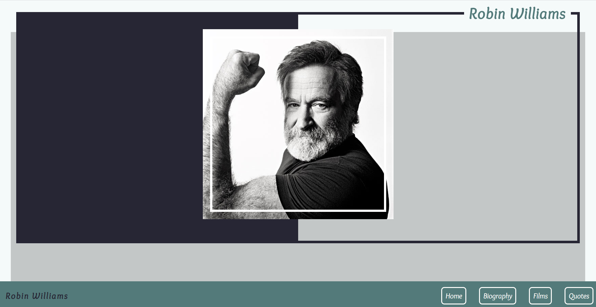
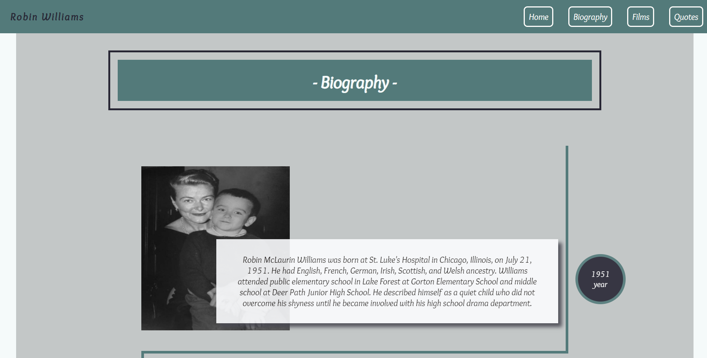

# Tribute Page




## Running example
Please , press [here](https://floating-beyond-15237.herokuapp.com/) to see running example hosted on Heroku.

Please , press [here](https://codepen.io/AnyaKarpiuk/pen/YzqqRyY) to see running example on CodePen.


## Build with

- [Node.js](https://nodejs.org/en/)
- [Express](https://expressjs.com/)
- CSS
- HTML
- [Heroku](https://dashboard.heroku.com/apps)

## To run this application on GitPod follow next steps 

#### 1. Open GitPod workspace for your repository
Enter https://gitpod.io/#yourRepositoryLink in a browser. It can take few minutes to load

#### 2. Clone current repository
```linux
git clone https://github.com/AnyaKarpiuk/tribute-page-html-css.git
```

#### 3. Install dependencies (if they aren't there)
```linux
npm install
```

#### 4. Run the development server
```linux
npm run dev
```

:+1:
